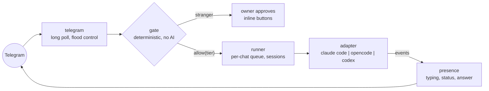

<h1 align="center">telegram-bot-skill</h1>

<p align="center">
  <strong>Your local CLI coding agent, reachable from your pocket: a zero-dependency bridge that turns any headless agent into a private Telegram bot.</strong>
</p>

<p align="center">
  
  
  = 22.18" />
  
  
</p>

<p align="center">
  
  
  
  
</p>

---

## What this is

A bridge, not an agent. Telegram messages go in, your local agent's answers come out, and every security decision on the way happens in deterministic code before any model sees a byte. It speaks the official Bot API directly over Node's built-in `fetch`: no framework, no wrapper, an empty dependency tree.

It exists to fix the three things that make agent-over-chat setups painful:

- **You never know if the bot is alive.** Here the typing indicator stays lit while the agent works, one status message tracks progress ("🔧 Bash: npm test"), the answer arrives separately, and every run ends in an explicit ✅ / ⚠️ / ⏱.
- **Strangers are all-or-nothing.** Here unknown users land in a pending queue, you get Approve / Guest / Block buttons, and everyone lives in a tier: owner, trusted, guest, blocked.
- **"The prompt says no" is not security.** Tiers map to the agent harness's own config (permission rules, hooks), so a denied tool stays denied no matter what a chat user talks the model into. Adapters that cannot enforce this honestly declare it, and the bridge refuses to route non-owner traffic through them.



## Run it

Requires Node >= 22.18 and, for the default adapter, the `claude` CLI. There is no install step.

```bash
git clone https://github.com/hec-ovi/telegram-bot-skill
cd telegram-bot-skill
TELEGRAM_BOT_TOKEN=123456789:AAE... npm start
```

First start prints a one-time claim link (`https://t.me/yourbot?start=...`). Open it in Telegram, tap Start, and you are the owner. Everyone else who messages the bot waits at the gate until you tap a button.

| Env var | Required | Default | What |
|---|---|---|---|
| `TELEGRAM_BOT_TOKEN` | yes | | Bot token from @BotFather |
| `STATE_FILE` | no | `./bot-state.json` | Users, tiers, sessions, poll offset |
| `AGENT_CWD` | no | current dir | Directory the agent works in |

### No token yet?

Two routes:

- **You know Telegram bots:** paste your existing token and go.
- **First time:** open Telegram, find `@BotFather`, send `/newbot`, pick a name, pick a username ending in `bot`, copy the token it gives you. One minute, free. Or skip reading entirely: tell your CLI agent *"set up the telegram bot from this repo"*. [SKILL.md](SKILL.md) is written for agents, and it will walk you through token creation, start the bridge, and hand you the claim link.

## Modules

Each module is isolated behind an explicit in/out contract (full detail in [ARCHITECTURE.md](ARCHITECTURE.md)); agent-specific code exists only inside `src/agents/<adapter>`.

| Module | Job | State |
|---|---|---|
| `src/telegram` | Bot API client: long poll, 429 backoff, 4096-char chunking | ✅ |
| `src/agents` | adapter contract + Claude Code adapter (live-captured stream-json) | ✅ |
| `src/presence` | typing loop, throttled status edits, chunked answers, timeouts | ✅ |
| `src/gate` | deterministic access decisions, owner claim, approvals | ✅ |
| `src/store` | flat JSON state, atomic writes, no database | ✅ |
| `src/runner` | per-chat queue, session resume, capability refusal | ✅ |
| `src/policy` | tier to harness-config mapping (settings, hooks, flags) | 🔜 next |

## Roadmap

| Phase | What | State |
|---|---|---|
| 0 to 5 | contracts, telegram client, adapters, presence, gate, runnable bot | ✅ |
| 6 | per-tier tool enforcement inside the harness (settings + PreToolUse hooks) | 🔜 next |
| 7 | onboarding wizard + QR claim code in the terminal | ⬜ |
| 8 | opencode, Codex CLI, Gemini CLI adapters | ⬜ |
| 9 | hardening: rate limits, audit log, token hygiene | ⬜ |
| 10 | packaging: skill install routes, npm publish | ⬜ |
| 11 | local MCP server surface | ⬜ |

Full plan with the reasoning per phase: [ROADMAP.md](ROADMAP.md).

## Tests

```bash
npm test
```

45 tests on Node's built-in runner: the Telegram client is exercised end to end against a real local `node:http` fake of the Bot API (long-poll holds, flood control, offset resume), the Claude Code adapter against a scripted fake binary, and the whole bot through a full simulated conversation: claim, stranger knocks, forged approval rejected, owner approves, agent answers with live status, session resumes, troll blocked.

## Why zero dependencies

The bridge wraps exactly two things: the official Bot API and a local agent binary. Node 24 already ships everything needed to do that: `fetch`, a test runner, native TypeScript type stripping. Every dependency avoided is a supply-chain door that stays closed, which matters for a program whose job is to stand between the internet and a shell-capable agent. Recent CVE history in this exact product category is the cautionary tale.

```
src/
  telegram/   Bot API client, poller, chunking, outbox
  agents/     contract + claude-code adapter (more to come)
  presence/   the "is it thinking or dead" layer
  gate/       deterministic access decisions
  store/      flat-file state
  runner/     queue + sessions + capability checks
  app.ts      wiring (testable), bot.ts: executable entry
```

MIT. Built by [Hector Oviedo](https://github.com/hec-ovi).
